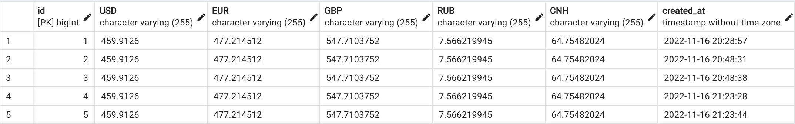
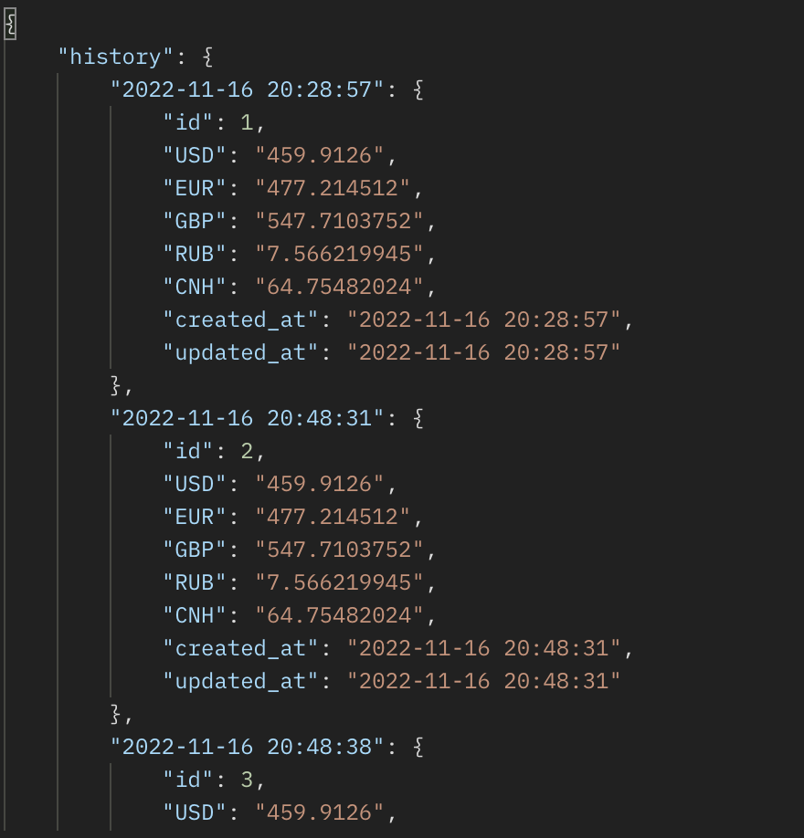

# Тестовое задание по парсингу валюты и возврату истории

## Задание
Написать сервис для парсинга валюты в реальном времени. Данный сервис так же должен хранить историю парсинга, чтобы в дальнейшем можно
было отобразить историю валюты

## Описание
Для выполнения данной задачи, я пользовался сервисом RapidAPI, а именно следующей API:
<a href="https://rapidapi.com/fyhao/api/currency-exchange">Currency Exchange</a>. Получив отсюда курс валют (стоимость одной единицы данной валюты в тенге):
<ul>
    <li>USD</li>
    <li>EUR</li>
    <li>GBP</li>
    <li>RUB</li>
    <li>CNH</li>
</ul>

Я записываю данные в таблицу в базе данных (используя Eloquent ORM), через Job. Данный Job вызываеться в команде, которая отвечает за парсинг. Сама команда вызывается через Kernel каждые 2 минуты (Для того, чтобы работал Kernel рекомендуется настроить cron на вашем сервере).
<br>
Наша База Данных будет выглядить следующим образом:

Для того, чтобы получить историю парсинга, вам необходимо направить GET запрос по роуту:
```
 [GET] localhost:8000/history
```

После чего, вы получите ответ в виде JSON:

Конечно же, есть идеи для доработки данного задания, но пока что ограничусь данным функционалом.

